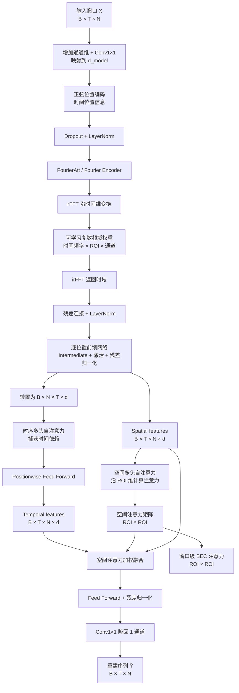
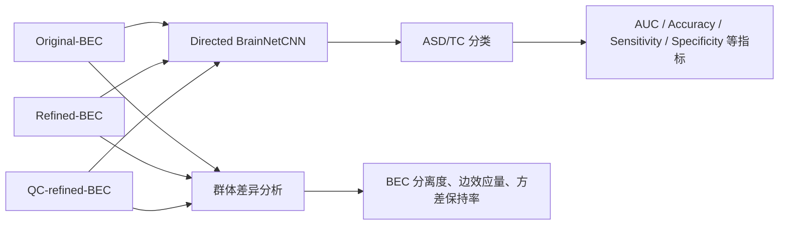

# Graph-BEC 模型框架说明

本文档根据 `Graph_BEC/model` 及其调用流程整理，用于绘制模型框架图。模型的核心目标是：

> 从每个被试的 ROI 时间序列中学习个体化有向脑边连接（BEC），再利用被试间相似图构造邻居参考 BEC，并通过无标签的边级修正得到更稳定的脑网络表示。

最终可以将 `Original-BEC`、`Refined-BEC` 和 `QC-refined-BEC` 分别送入下游 `Directed BrainNetCNN` 进行 ASD/TC 分类比较。

---

## 1. 总体框架

```mermaid
flowchart LR
    A[ROI 时间序列<br/>每个被试: T × 90] --> B[预处理<br/>取前 90 个 ROI<br/>按时间维标准化]

    B --> C{输入模式}
    C -->|raw| D[FSTA-EC 无监督训练]
    C -->|bec| E[读取已有 Subject-BEC]
    D --> F[滑动窗口推理]
    F --> G[窗口级空间注意力平均]
    E --> H[Original-BEC<br/>N × 90 × 90]
    G --> H

    H --> I[训练折内数据划分<br/>Train / Validation / Test]
    I --> J[被试相似图构建]
    J --> J1[表型图<br/>连续变量 + 分类变量]
    J --> J2[fMRI 图<br/>FC 上三角 4005 维]
    J1 --> J3{graph-mode}
    J2 --> J3
    J3 -->|phenotype| K[表型邻居权重]
    J3 -->|fusion| L[β·fMRI图 + (1-β)·表型图<br/>Top-k 归一化]
    K --> M[邻居参考 BEC<br/>加权平均训练折 BEC]
    L --> M

    H --> N[PGR-BEC Static<br/>静态表型引导修正]
    M --> N
    N --> O[Refined-BEC]

    H --> P[QSR-BEC Refiner<br/>QC 敏感性引导修正]
    M --> P
    Q[训练折 QC 指标<br/>及混杂变量] --> R[QC artifact basis<br/>QC-sensitive map + pseudo-target]
    R --> P
    P --> S[QC-refined-BEC]

    H --> T[Original]
    O --> U[Directed BrainNetCNN<br/>交叉验证分类]
    S --> U
    T --> U
    U --> V[分类指标、群体差异<br/>边效应量与方差保持率]
```

### 关键原则

1. **BEC 生成和修正不使用诊断标签**：诊断标签只用于下游分类及 ASD/TC 群体差异分析。
2. **邻居参考只由训练折建立**：验证集和测试集只能查询训练折，避免信息泄漏。
3. **最终保留三种表示**：原始 `Original-BEC`、表型修正 `Refined-BEC`、QC 修正 `QC-refined-BEC`。
4. **每个 BEC 是有向矩阵**：矩阵的行列方向有意义，且对角线被强制置零。

---

## 2. 输入与符号约定

设：

| 符号 | 含义 | 典型形状 |
|---|---|---|
| `B` | 一个训练批次中的窗口数量 | 标量 |
| `T` | 窗口长度 | `window_length` |
| `N` | ROI 数量 | `90` |
| `d` | 隐藏特征维度 | `d_model` |
| `X` | 一个批次的 ROI 时间序列窗口 | `[B, T, N]` |
| `A` | 一个被试的 Original-BEC | `[N, N]` |
| `A_ref` | 由相似被试加权得到的邻居参考 BEC | `[N, N]` |
| `G` | 边级修正门控系数 | `[N, N]` |

数据加载阶段将原始 ROI 数量统一到前 90 个 ROI，并对每个被试的时间序列沿时间维进行标准化。因此，模型输入可以表示为：

\[
X \in \mathbb{R}^{B \times T \times 90}.
\]

---

## 3. FSTA-EC：从时间序列生成 Original-BEC

对应代码：

- `fsta_ec/fsta_training.py`
- `fsta_ec/fsta_components/fsta.py`
- `fsta_ec/fsta_components/fourier_att.py`
- `fsta_ec/fsta_components/st_multi_head_att.py`
- `fsta_ec/fsta_utils.py`

### 3.1 FSTA 的内部结构



### 3.2 编码阶段

输入首先通过 `Conv2d(1, d_model, kernel_size=1)` 映射到隐藏空间，并加上固定的正弦位置编码：

\[
H_0 = \operatorname{LayerNorm}(\operatorname{Dropout}(\operatorname{Conv1\times1}(X)+P)).
\]

随后进入 `FourierAtt`。其核心不是直接学习全连接的时间关系，而是：

1. 沿时间轴进行实数快速傅里叶变换 `rFFT`；
2. 使用可学习的复数权重调制不同时间频率；
3. 通过 `irFFT` 返回时域；
4. 使用残差连接和归一化保留原始时序信息；
5. 经过逐位置前馈网络增强非线性表达。

频域权重的逻辑形状为：

\[
[1, T/2+1, N, d],
\]

因此模型可以对不同时间频率、不同 ROI 以及不同隐藏通道进行独立调制。

### 3.3 时序分支与空间分支

Fourier 编码输出同时用于两个注意力操作：

- **时序分支**：将特征排列为 `[B, N, T, d]`，在每个 ROI 的时间维上执行多头自注意力，用于建模时间依赖；
- **空间分支**：保留 `[B, T, N, d]`，在每个时间位置的 ROI 维上执行多头自注意力，用于学习 ROI-to-ROI 的空间关系。

多头注意力内部包含：

\[
Q=XW_Q,\quad K=XW_K,\quad V=XW_V,
\]

\[
\operatorname{Attention}(Q,K,V)
=\operatorname{Softmax}\left(\frac{QK^T}{\sqrt{d_k}}\right)V.
\]

注意力输出经过多头拼接、线性投影、Dropout、残差连接和 `LayerNorm`。

### 3.4 重建与窗口级 BEC

空间注意力矩阵用于将时序特征映射回空间关系：

\[
H_{fused}=\operatorname{FFN}(H_{temporal} \cdot W_s + H_{spatial}),
\]

再通过 `Conv2d(d_model, 1, kernel_size=1)` 得到重建序列：

\[
\hat{X} \in \mathbb{R}^{B \times T \times N}.
\]

代码中 `STMultiHeadAtt` 对多头注意力进行平均，最终得到 ROI 间的空间注意力矩阵 `W_s`。在被试级 BEC 提取时，对该被试所有滑动窗口的注意力求平均，并进行转置：

\[
A^{(s)} = \left(\frac{1}{M_s}\sum_{m=1}^{M_s}W_s^{(m)}\right)^T,
\]

其中 `M_s` 是被试 `s` 的窗口数。最后令：

\[
A^{(s)}_{ii}=0,
\]

得到该被试的 `Original-BEC`。

### 3.5 FSTA 的无监督训练目标

基本重建损失为：

\[
\mathcal{L}_{rec}=\operatorname{MSE}(\hat{X},X).
\]

默认 `loss_mode="entropy"` 时，对空间注意力进行归一化并计算归一化熵：

\[
\mathcal{L}_{ent}
=\frac{1}{\log N}\nobreak\operatorname{Mean}\left[-\sum_j p_j\log p_j\right].
\]

总损失为：

\[
\mathcal{L}_{FSTA}=\mathcal{L}_{rec}+\alpha\mathcal{L}_{ent}.
\]

这里不包含 ASD/TC 分类损失，因此 BEC 生成阶段是无监督的。

---

## 4. 被试相似图与邻居参考 BEC

对应代码：

- `fusion_graph/phenotype.py`
- `normative_bec.py`
- `workflow.py::build_fold_reference`

### 4.1 表型图

每个被试由两类表型特征描述：

- 连续变量，例如 `FIQ`、`PIQ`；
- 分类变量，例如性别、站点或数据集相关类别。

表型距离由加权连续变量距离和分类变量惩罚组成：

\[
d(i,j)=\sum_r w_r(x_{ir}-x_{jr})^2
+\lambda\sum_c\mathbf{1}(z_{ic}\ne z_{jc}).
\]

对每个查询被试选择距离最小的 `k` 个训练折邻居，并通过高斯型亲和度及行归一化获得权重：

\[
w_{ij}=\frac{\exp(-d(i,j)/h)}{\sum_{j'\in\mathcal{N}_k(i)}\exp(-d(i,j')/h)}.
\]

### 4.2 fMRI 功能连接图

对每个被试的 `[T, 90]` ROI 时间序列计算 Pearson 相关矩阵，取上三角非对角元素：

\[
\frac{90\times89}{2}=4005
\]

维功能连接特征。随后使用余弦相似度构造 Top-k 图，并进行行归一化。

### 4.3 多视图融合图

当 `graph_mode="phenotype"` 时，仅使用表型图；当 `graph_mode="fusion"` 时，融合 fMRI 图和表型图：

\[
W_{fusion}=\operatorname{TopKNormalize}
\left(\beta W_{fmri}+(1-\beta)W_{pheno}\right).
\]

其中 `β` 控制 fMRI 相似性和表型相似性的相对贡献。

### 4.4 邻居参考 BEC

对于查询被试 `i`，使用训练折 BEC 的加权平均构造个体化邻居参考：

\[
A_{ref}^{(i)}=\sum_{j\in Train}w_{ij}A^{(j)}.
\]

`A_ref` 不是一个全局固定模板，而是每个被试对应的、由其相似训练邻居决定的参考 BEC。

---

## 5. PGR-BEC：表型引导的静态边级修正

对应代码：`pgr/pgr_bec.py` 和 `refinement.py::train_pgr_refiner`。

### 5.1 输入与门控

PGR 的输入由三部分组成：

\[
[A, A_{ref}, |A_{ref}-A|].
\]

这三个通道通过两个 `1×1 Conv2d + LeakyReLU` 层和一个输出卷积得到边级门控：

\[
G=G_{max}\cdot\operatorname{Sigmoid}
\left(f_{gate}([A,A_{ref},|A_{ref}-A|])\right).
\]

最终修正为：

\[
A_{PGR}=A+G\odot(A_{ref}-A).
\]

其中 `G_max` 限制单条边最多引入的参考信息比例，且 BEC 对角线始终置零。

### 5.2 PGR 的训练约束

PGR 使用无监督静态修正损失：

\[
\mathcal{L}_{PGR}
=\lambda_a\mathcal{L}_{anchor}
+\lambda_g\mathcal{L}_{gate}
+\lambda_v\mathcal{L}_{variance}.
\]

其中：

- `anchor loss`：约束修正结果不要偏离初始 BEC 过远；
- `gate loss`：约束门控稀疏，避免所有边都被修改；
- `variance loss`：保持跨被试边的方差，避免过度平滑。

因此 PGR 的作用可以概括为：**只在模型认为有必要的边上，向相似被试参考 BEC 进行有限度靠拢**。

---

## 6. QSR-BEC：QC 引导的自监督弱修正

对应代码：`qsr/qsr_bec.py`、`qsr/qc.py` 和 `refinement.py::train_qsr_refiner`。

### 6.1 QC 先验构建

QSR 只使用训练折中的 QC 指标和混杂变量：

1. 对训练折 QC 指标进行缩放，得到 `QC badness`；
2. 使用 BEC、QC badness 和混杂变量拟合 QC 相关的有向 BEC 基底 `qc_basis`；
3. 对基底的绝对值求平均并归一化，得到 ROI-to-ROI 的 `qc_sensitive_map`；
4. 根据 QC 基底构造受控的伪目标 `pseudo_target`；
5. 对伪目标施加模拟的联合 QC 扰动，形成 corrupted BEC。

伪目标可以写为：

\[
A_{pseudo}=A-\eta\cdot\operatorname{QC}(A),
\]

并通过最大相对变化比例 `r_max` 限制修正幅度。

### 6.2 QSR 网络结构

QSR 的四个输入通道为：

\[
[A,A_{ref},|A_{ref}-A|,M_{QC}],
\]

其中 `M_QC` 是 QC 敏感性图。网络结构为：

```text
4 通道输入
    ↓ 1×1 Conv2d
LeakyReLU
    ↓ DirectedE2E
LeakyReLU
    ↓ DirectedE2E
LeakyReLU
    ├── gate_head      → G ∈ [0, gate_max]
    └── direction_head → D ∈ [-1, 1]
```

修正公式为：

\[
A_{QSR}=A+G\odot D\odot(A_{ref}-A).
\]

与 PGR 不同，QSR 同时学习：

- **修正强度**：`G`，表示该边应修改多少；
- **修正方向**：`D`，表示沿邻居差异方向靠近还是反向调整。

### 6.3 QSR 自监督目标

QSR 同时将原始输入和 QC 扰动输入送入同一个网络：

\[
A_{QSR}^{orig}=f(A,A_{ref},M_{QC}),
\]

\[
A_{QSR}^{corr}=f(A_{corr},A_{ref},M_{QC}).
\]

总损失包括：

\[
\mathcal{L}_{QSR}
=\mathcal{L}_{pseudo}^{orig}
+\mathcal{L}_{restore}^{corr}
+\lambda_g\mathcal{L}_{gate}
+\lambda_v\mathcal{L}_{variance}.
\]

- `pseudo loss`：原始输入的修正结果接近 QC 伪目标；
- `restore loss`：受到模拟 QC 扰动后仍恢复到伪目标；
- `gate loss`：限制门控过度激活；
- `variance loss`：保留跨被试的 BEC 变化。

因此 QSR 的核心思想是：**利用训练折中估计出的 QC 伪目标和扰动恢复任务，学习对 QC 敏感边进行稳定、受限的修正**。

---

## 7. 交叉验证与无信息泄漏流程

每个交叉验证 fold 的处理顺序如下：

```text
1. 按标签划分 Train / Validation / Test
2. 仅使用 Train 拟合 BEC 标准化参数
3. 仅使用 Train 构建 phenotype / fMRI / fusion 邻居图
4. 由 Train BEC 为 Train、Validation、Test 分别生成邻居参考 BEC
5. 仅使用 Train 训练 PGR 或 QSR 修正器
6. 将训练好的修正器应用到 Validation 和 Test
7. 对 Original / Refined / QC-refined 分别训练分类器
8. 汇总 Test-only out-of-fold 结果
```

测试集不参与以下步骤：

- 表型距离参考库拟合；
- fMRI 特征标准化参数估计；
- BEC 标准化参数估计；
- PGR/QSR 参数训练；
- QSR QC basis、QC-sensitive map 和伪目标构建。

这使得最终分类性能可以更接近真实的独立测试场景。

---

## 8. 下游分类与输出

三种 BEC 表示分别进入 `Directed BrainNetCNN`：



主要输出：

- `Original-BEC`：`*_subject_bec.npz`；
- `Refined-BEC`：`*_refined_subject_bec.npz`；
- `QC-refined-BEC`：`*_qsr_refined_subject_bec.npz`；
- 交叉验证分类指标和汇总结果。

---

## 9. 画图时建议拆成的模块

如果绘制论文级模型框架图，建议分成以下 5 个大模块：

1. **Input preprocessing**：ROI 时间序列、90 ROI、标准化、滑动窗口；
2. **FSTA-EC**：位置编码、Fourier filtering、Temporal MHA、Spatial MHA、序列重建；
3. **Original-BEC extraction**：窗口空间注意力平均、转置、去对角线；
4. **Patient graph-guided refinement**：表型/fMRI 图、邻居参考 BEC、PGR 和 QSR 两条修正分支；
5. **Downstream evaluation**：Original/Refined/QC-refined 输入 Directed BrainNetCNN，输出分类与解释性指标。

图中建议明确标注以下张量：

```text
ROI time series:       T × 90
FSTA window batch:     B × T × 90
Spatial attention:     90 × 90
Subject-BEC:           90 × 90
Neighbor reference:    90 × 90
Patient graph weights: number_of_queries × number_of_train_subjects
fMRI FC feature:       4005
```

---

## 10. 代码对应关系

| 框架模块 | 主要代码 |
|---|---|
| 数据读取、ROI 截取、标准化 | `Graph_BEC/data/` |
| FSTA 训练 | `Graph_BEC/model/fsta_ec/fsta_training.py` |
| FSTA 主体 | `Graph_BEC/model/fsta_ec/fsta_components/fsta.py` |
| Fourier 编码器 | `Graph_BEC/model/fsta_ec/fsta_components/fourier_att.py`、`fourier_att_modules.py` |
| 时空多头注意力 | `Graph_BEC/model/fsta_ec/fsta_components/st_multi_head_att.py`、`multi_head_att.py` |
| BEC 提取 | `Graph_BEC/model/fsta_ec/fsta_utils.py` |
| 表型图与 fMRI 图 | `Graph_BEC/model/fusion_graph/phenotype.py` |
| 邻居参考 BEC | `Graph_BEC/model/normative_bec.py` |
| PGR-BEC | `Graph_BEC/model/pgr/pgr_bec.py` |
| QSR-BEC | `Graph_BEC/model/qsr/qsr_bec.py`、`qc.py` |
| Fold 训练和推理 | `Graph_BEC/model/refinement.py`、`Graph_BEC/workflow.py` |
| 分类与结果汇总 | `Graph_BEC/downstream/`、`Graph_BEC/runner.py` |

